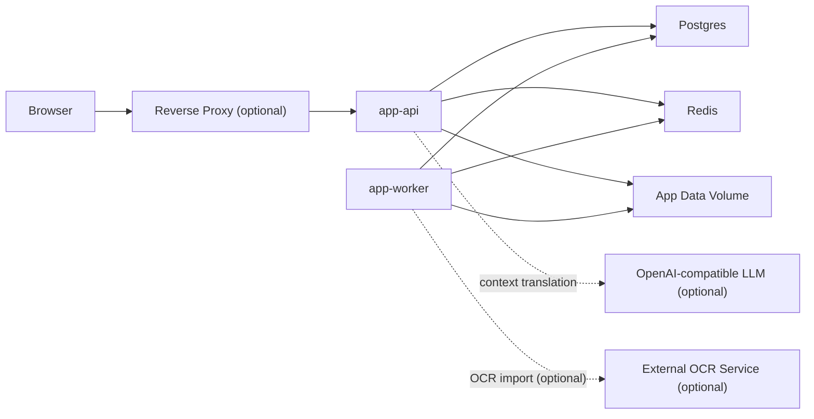

# Flinq MVP Architecture Overview

- Статус: Draft v1
- Дата: 2026-04-11
- Основано на: [Спецификации](/Users/shibaev/Dev/github/Flinq/docs/lingq-like-self-hosted-spec-2026.md), [Decision log](/Users/shibaev/Dev/github/Flinq/docs/specs/2026-04-11-mvp-product-alignment-design.md), [ADR-0001](/Users/shibaev/Dev/github/Flinq/docs/adr/ADR-0001-unit-of-learning-token-level.md), [ADR-0003](/Users/shibaev/Dev/github/Flinq/docs/adr/ADR-0003-llm-provider-openai-compatible.md), [ADR-0004](/Users/shibaev/Dev/github/Flinq/docs/adr/ADR-0004-dictionary-wiktionary-provider.md), [ADR-0005](/Users/shibaev/Dev/github/Flinq/docs/adr/ADR-0005-word-status-model-lingq-levels.md), [ADR-0006](/Users/shibaev/Dev/github/Flinq/docs/adr/ADR-0006-tech-stack.md). ADR-0002 — superseded by ADR-0005.

## 1. Назначение документа

Этот документ фиксирует высокоуровневую архитектуру Flinq для MVP и ближайшего post-MVP периода. Его задача:

- превратить продуктовые решения и ADR в понятную техническую форму;
- определить deployable-контур для self-hosted поставки;
- зафиксировать границы модулей и ownership данных;
- снизить риск преждевременного распила системы на микросервисы.

Если этот документ конфликтует с принятым ADR, **приоритет у ADR**. Если конфликтует с более ранними продуктово-выравнивающими заметками, приоритет у актуальных ADR и этого документа.

## 2. Архитектурные цели

MVP-архитектура должна обеспечивать:

- single-tenant self-hosted поставку для `personal homelab + small team`;
- развёртывание через `Docker Compose`;
- web-first продукт без native mobile и без offline-first в MVP;
- работоспособность базового режима без внешнего AI;
- поддержку LingQ-style reader-flow, token-level модели и локального словаря;
- расширяемость для future OCR, audio/video, TTS/STT и richer AI flows;
- низкую операционную сложность для инсталляций без отдельной DevOps-команды.

## 3. Рекомендуемый архитектурный стиль

Для MVP рекомендуется **modular monolith + background worker**.

Это означает:

- один application codebase;
- один основной runtime-процесс `api`;
- один фоновый runtime-процесс `worker`;
- общая транзакционная БД;
- чёткие внутренние доменные модули с изолированным ownership.

Почему не микросервисы в MVP:

- целевой deployment маленький и self-hosted;
- reader, vocabulary, review и stats тесно связаны транзакционно;
- отдельные сервисы слишком рано увеличат сложность деплоя, отладки и миграций;
- большая часть выигрыша от разделения достигается и внутри модульного монолита, если держать явные boundaries.

Почему не “всё в одном процессе без worker”:

- import pipeline, dictionary refresh, export и cleanup лучше вынести в асинхронный контур;
- worker позволит позже добавить OCR/media ingestion без изменения общего shape системы.

## 4. Runtime baseline

Backend Flinq для MVP и ближайших итераций проектируется на **Python 3.13+**.

Это означает:

- `app-api` и `app-worker` работают на одном Python codebase;
- все backend-зависимости должны быть совместимы с Python `3.13+`;
- новые backend-модули можно сразу писать с расчётом на современный typing и актуальные language features;
- не нужно сохранять совместимость со старыми runtime вроде `3.10` или `3.11`, если для этого нет отдельной бизнес-причины.

Архитектурное следствие:

- любые framework и infra decisions для backend нужно проверять не только по зрелости, но и по реальной готовности к Python `3.13+`;
- `Docker`-образ для `app-api` и `app-worker` должен строиться на Python `3.13+` base image;
- фоновые задачи, import pipeline и AI integration не должны завязываться на библиотеки, которые заметно отстают по поддержке новых Python-версий.

Полный tech stack — web framework, ORM, job queue, frontend, инструменты разработки, repository layout — зафиксирован в **ADR-0006**. Коротко: FastAPI + SQLAlchemy 2.x async + Taskiq + loguru + uv + ruff + pyright на backend'е, React 19 + TypeScript + Vite + TanStack Query + Zustand + Tailwind CSS v4 на frontend'е, monorepo с `backend/` и `frontend/` подпапками.

## 5. Контейнерный контур

### 5.1 MVP deployment shape

Минимальный контур поставки:

- `app-api` — HTTP API + serving web assets;
- `app-worker` — фоновые задачи;
- `postgres` — source of truth для продуктовых данных;
- `redis` — очередь задач и короткоживущий cache;
- `app-data` volume — локальное файловое хранилище для импортов, экспортов и служебных артефактов.

Опциональные внешние зависимости:

- OpenAI-compatible LLM endpoint;
- внешний OCR service;
- reverse proxy с TLS termination.

### 5.2 Container diagram

### 5.3 Почему frontend не отдельный сервис

Для MVP frontend не должен становиться отдельным deployable-сервисом. Практический вариант:

- frontend собирается в статические assets;
- `app-api` раздаёт их вместе с API;
- reverse proxy, если нужен, только проксирует один upstream.

Это уменьшает число контейнеров, упрощает конфигурацию CORS, cookie/session model и self-hosted установку.

## 6. Deployable components

| Компонент | Роль | Обязателен в MVP | Хранит бизнес-данные |
|---|---|---|---|
| `app-api` | REST/JSON API, auth, reader actions, dictionary lookup, AI translation gateway | да | нет |
| `app-worker` | import jobs, dictionary refresh, cleanup, exports, stats aggregation | да | нет |
| `postgres` | транзакционная БД | да | да |
| `redis` | queue backend, AI cache, ephemeral coordination | да | нет |
| `app-data volume` | загруженные файлы, временные артефакты, export files | да | частично |
| `LLM provider` | AI translation | опционально | нет |
| `OCR service` | OCR и text extraction вне ядра | опционально | нет |
| `reverse proxy` | TLS, host routing, compression | опционально, но рекомендован | нет |

## 7. Внутренние модули backend

Даже оставаясь модульным монолитом, backend должен быть разбит на явные доменные модули.

### 7.1 Identity and Settings

Отвечает за:

- регистрацию и логин;
- профиль пользователя;
- языковые настройки;
- роли `learner/admin`;
- экспорт и удаление профиля;
- системные настройки инстанса.

Owned data:

- `users`;
- `user_profiles`;
- `user_settings`;
- `sessions` или их эквивалент.

### 7.2 Lesson Library

Отвечает за:

- создание уроков;
- хранение lesson metadata;
- private/shared visibility;
- импорт текстового контента;
- lesson segmentation и lesson readiness state.

Owned data:

- `lessons`;
- `lesson_sources`;
- `lesson_segments`;
- `lesson_import_jobs`.

### 7.3 Reader State

Отвечает за:

- выдачу lesson content в reader;
- page/sentence navigation;
- bulk-known transitions;
- привязку reader actions к token/phrase instances внутри урока;
- сохранение последней позиции пользователя.

Owned data:

- `lesson_token_occurrences`;
- `lesson_phrase_occurrences`;
- `reader_positions`;
- `bulk_actions`.

### 7.4 Vocabulary

Отвечает за:

- token items;
- phrase items;
- пользовательские переводы;
- заметки и теги;
- LingQ-style states `new / tracked / known / ignored` (см. **ADR-0005**);
- confidence-level `0..5` внутри статуса `tracked`.

Детали статусной модели, переходов, визуала в reader'е и поведения карточки — ADR-0005. Этот ADR supersedes ADR-0002 (историческую трёхстатусную модель).

Owned data:

- `token_items`;
- `phrase_items`;
- `personal_translations`;
- `personal_notes`;
- `item_tags`.

### 7.5 Dictionary

Отвечает за:

- lookup по локальному словарю;
- provider abstraction;
- dictionary attribution;
- refresh словарных данных.

Owned data:

- `dictionary_entries`;
- `dictionary_translations`;
- `dictionary_examples`;
- `dictionary_source_versions`.

### 7.6 Review Engine

Отвечает за:

- review queue;
- token/phrase review items;
- review history;
- scheduling algorithm;
- graduation rules.

Owned data:

- `review_items`;
- `review_events`;
- `review_queue_state`.

Важно: точный SRS algorithm остаётся отдельным решением, но ownership модуля должен быть выделен уже сейчас.

### 7.7 AI Translation

Отвечает за:

- формирование prompt для контекстного перевода;
- вызов OpenAI-compatible provider;
- privacy-safe logging;
- per-user AI cache;
- kill-switch behaviour.

Owned data:

- `ai_requests` или эквивалентный metadata-audit;
- AI cache keys и metadata.

### 7.8 Statistics

Отвечает за:

- агрегаты по reader activity;
- coverage metrics;
- counters по known/tracked/ignored;
- precomputed snapshots для dashboard.

Owned data:

- `stats_snapshots`;
- `daily_user_stats`;
- `lesson_progress`.

### 7.9 Admin Operations

Отвечает за:

- provider configuration;
- dictionary refresh orchestration;
- system health view;
- data retention jobs;
- export / import maintenance actions.

## 8. Принцип хранения данных

### 8.1 Source of truth

`Postgres` является единственным источником правды для продуктовых данных.

Там должны храниться:

- пользователи и настройки;
- уроки и lesson structure;
- token/phrase items;
- словарная база;
- review history;
- агрегированная статистика;
- metadata по AI и jobs.

### 8.2 Что идёт в Redis

`Redis` используется только для:

- job queue;
- AI cache с TTL;
- короткоживущих coordination-key;
- rate-limit примитивов, если появятся позже.

Нельзя использовать Redis как единственный источник правды для пользовательского состояния.

### 8.3 Что идёт в файловое хранилище

В `app-data volume` или storage adapter идут:

- исходные импортированные текстовые файлы;
- результаты export jobs;
- временные ETL-артефакты;
- словарные dump-файлы до загрузки в БД.

Для MVP рекомендуется **локальный volume + storage adapter**, а не обязательный `S3/MinIO`. Это сохраняет простоту поставки и оставляет возможность заменить хранилище позже без переписывания прикладной логики.

### 8.4 Search strategy

Для MVP не нужен отдельный search engine. Достаточно:

- `Postgres full-text search` для уроков;
- индексов по нормализованным token/phrase полям;
- простых фильтров по языку, visibility, тегам и владельцу.

Отдельный `Elasticsearch/OpenSearch` в MVP не нужен.

## 9. Синхронные и асинхронные потоки

### 9.1 Синхронные HTTP-flow

Синхронно через `app-api` должны выполняться:

- логин и работа с профилем;
- открытие урока в reader;
- переход между страницами и bulk-known;
- добавление слова/фразы в изучение;
- изменение confidence-level;
- dictionary lookup;
- AI translation request;
- открытие review session и отправка review answer.

### 9.2 Асинхронные jobs

Через `app-worker` и queue должны выполняться:

- import normalization;
- lesson segmentation/tokenization;
- phrase occurrence materialization;
- dictionary refresh;
- user data export;
- cleanup AI cache/audit по retention policy;
- stats aggregation и rebuild;
- OCR import orchestration, если OCR включён.

Принцип:

- всё, что пользователь ждёт непосредственно в reader, должно быть синхронным;
- всё, что может занять секунды и минуты, должно идти через queue.

## 10. Ключевые потоки данных

### 10.1 Импорт урока

1. Пользователь загружает `.txt` или `.md`.
2. `app-api` создаёт lesson record и import job.
3. `app-worker` нормализует текст, сегментирует его и материализует token/phrase occurrences.
4. Урок переходит в `ready`.
5. Reader может открыть lesson.

### 10.2 Клик по слову в reader

1. Reader отправляет `lesson_id`, `token occurrence`, `user_id`, `context window`.
2. `app-api` ищет пользовательскую token item запись.
3. `Dictionary` модуль делает lookup по локальной базе.
4. Если AI включён и нужен contextual translation, вызывается `AI Translation`.
5. Карточка собирается с приоритетом пользовательского перевода над автоматическими источниками.

### 10.3 Add to study / Ignore / Bulk-known

1. Пользователь кликает слово.
2. Выбирает `Ignore` или `Add to study` с confidence-level.
3. `Vocabulary` создаёт или обновляет token item.
4. `Review Engine` создаёт или обновляет review item.
5. При `Next` `Reader State` переводит все оставшиеся `new` occurrences текущей страницы в `known`.

### 10.4 Review session

1. Пользователь открывает review.
2. `Review Engine` отдаёт единый queue для token и phrase items.
3. Ответ пользователя записывается как review event.
4. Review item получает новое расписание и, при необходимости, новый confidence/status.
5. `Statistics` обновляет агрегаты синхронно или отложенно.

## 11. API surface

Для MVP достаточно одного внутреннего HTTP API.

Основные группы endpoint-ов:

- `/auth`;
- `/me`;
- `/lessons`;
- `/reader`;
- `/vocabulary`;
- `/dictionary`;
- `/review`;
- `/stats`;
- `/admin`.

Публичный внешний API для third-party интеграций в MVP не обязателен. Но внутренний API должен проектироваться стабильно и без сильной связки с конкретным frontend framework.

## 12. Session and auth model

Для MVP рекомендуется:

- email/password auth;
- server-side session или короткоживущие signed cookies;
- без отдельного auth-service;
- без JWT-экосистемы для межсервисных вызовов, так как в MVP межсервисной сети нет.

Причина простая: для single-tenant self-hosted инсталляции это надёжнее и проще, чем тащить полноценную token-based distributed auth model.

## 13. Наблюдаемость и эксплуатация

В MVP достаточно следующего:

- structured logs для `app-api` и `app-worker`;
- health endpoints для API и worker;
- базовые readiness checks для Postgres и Redis;
- документированный backup/restore process;
- явный retention для AI audit и cache.

Что не нужно в MVP:

- распределённый tracing stack;
- Prometheus/Grafana как обязательная часть поставки;
- сложный runtime config service.

## 14. Security и privacy boundaries

Архитектура должна соблюдать уже принятые privacy-решения:

- продукт работает без внешнего AI;
- словарь работает локально;
- AI logs содержат только metadata-first данные;
- AI cache per-user;
- провайдерские секреты живут в env контейнера;
- user content не должен по умолчанию попадать в обычные application logs.

Также рекомендуется:

- RBAC минимум на уровне `learner/admin`;
- CSRF-защита для cookie-based auth;
- rate limiting на auth endpoints;
- hard-delete профиля как отдельный controlled workflow.

## 15. Эволюция после MVP

Архитектура должна развиваться эволюционно, а не через ранний big bang rewrite.

Первые кандидаты на выделение в отдельные сервисы, если система вырастет:

- `content ingestion`, когда появятся OCR, audio/video и тяжёлый media pipeline;
- `ai gateway`, если появятся routing, fallback, prompt templates и несколько провайдеров;
- `search`, если `Postgres FTS` перестанет справляться;
- `analytics`, если потребуется тяжёлая агрегатная отчётность.

До этого момента система должна оставаться одним application codebase.

## 16. Что делать следующим документом

После этого `Architecture Overview` логично подготовить ещё три артефакта:

- `Domain Model / ERD`;
- `Core Flows`;
- `Deployment and Operations Guide`.

Именно в таком порядке. Не наоборот.
