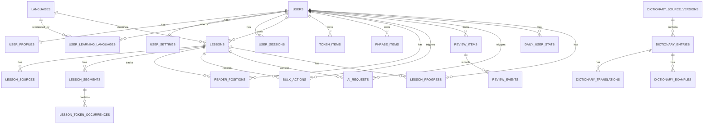

# Flinq MVP Domain Model / ERD

- Статус: Draft v1.1
- Дата: 2026-04-11; патч 2026-05-01 (identity module: `users.onboarded_at`, `user_settings.last_learning_language_code`, новая таблица `user_learning_languages`)
- Основано на: [Architecture Overview](/Users/shibaev/Dev/github/Flinq/docs/architecture/2026-04-11-mvp-architecture-overview.md), [ADR-0001](/Users/shibaev/Dev/github/Flinq/docs/adr/ADR-0001-unit-of-learning-token-level.md), [ADR-0003](/Users/shibaev/Dev/github/Flinq/docs/adr/ADR-0003-llm-provider-openai-compatible.md), [ADR-0004](/Users/shibaev/Dev/github/Flinq/docs/adr/ADR-0004-dictionary-wiktionary-provider.md), [ADR-0005](/Users/shibaev/Dev/github/Flinq/docs/adr/ADR-0005-word-status-model-lingq-levels.md), [ADR-0007](/Users/shibaev/Dev/github/Flinq/docs/adr/ADR-0007-url-and-routing.md), [ADR-0008](/Users/shibaev/Dev/github/Flinq/docs/adr/ADR-0008-auth-model.md)

## 1. Назначение документа

Этот документ фиксирует предметную модель MVP: основные сущности, связи, ownership данных и инварианты.

Это **не** финальный SQL DDL и не готовые SQLAlchemy-модели. Это каноническая high-level модель, по которой дальше должны проектироваться:

- ORM-модели;
- миграции;
- REST DTO;
- module boundaries;
- reader/review flows.

Если этот документ конфликтует с ADR, приоритет у ADR.

## 2. Главные принципы моделирования

### 2.1 Lesson facts и user knowledge разделены

В модели Flinq надо жёстко разделять:

- факты урока;
- пользовательское знание.

Факты урока:

- текст урока;
- сегменты;
- token occurrences;
- source metadata.

Пользовательское знание:

- token items;
- phrase items;
- confidence;
- пользовательские переводы;
- review history;
- reader progress.

Это разделение критично. Один и тот же урок общий для всех пользователей, а знания по нему у каждого свои.

### 2.2 `new` — это вычисляемое состояние, а не обязательная запись

Для token-level reader это очень важное решение.

`new` не должен обязательно храниться как отдельная строка в `token_items`. Для token occurrence состояние `new` означает:

- пользователь ещё не создал `tracked`, `known` или `ignored` item для этой словоформы;
- значит, состояние выводится из **отсутствия user-specific item**.

Практическое следствие:

- `tracked`, `known` и `ignored` требуют persisted row;
- `new` является default reader state при отсутствии row.

Это уменьшает количество данных и упрощает storage model.

### 2.3 Lemma в MVP отсутствует

По [ADR-0001](/Users/shibaev/Dev/github/Flinq/docs/adr/ADR-0001-unit-of-learning-token-level.md) сущность `Lemma` не вводится.

Значит:

- `books` и `book` — это разные token items;
- `книга` и `книги` — это разные token items;
- reader и review работают на уровне surface form;
- любая будущая lemma-model будет отдельным дополнительным слоем, а не частью MVP-ядра.

### 2.4 Token occurrence и Token item — не одно и то же

Это центральный кусок модели:

- `lesson_token_occurrence` отвечает на вопрос: какое слово и где стоит в уроке;
- `token_item` отвечает на вопрос: что пользователь знает про эту словоформу.

Один `token_item` может соответствовать многим occurrences в разных уроках.

### 2.5 Phrase — first-class learning item

Фраза не должна быть просто “списком токенов”.

В MVP:

- `phrase_item` существует как отдельная учебная сущность;
- у него есть собственный статус;
- у него есть собственный confidence;
- у него есть собственный review lifecycle.

### 2.6 Immutable identity для learning items

По [ADR-0001](/Users/shibaev/Dev/github/Flinq/docs/adr/ADR-0001-unit-of-learning-token-level.md):

- текст token item после создания immutable;
- phrase text после создания тоже должен рассматриваться как identity-defining;
- переводы, заметки и теги редактируются;
- сама учебная единица по смыслу не переписывается задним числом.

## 3. Логическая карта сущностей

Важно: эта диаграмма показывает только основные persisted relationships. Некоторые связи логические, а не прямые FK. Например, `lesson_token_occurrence` не обязан иметь FK на `token_item`.

## 4. Reference data

### 4.1 `languages`

Назначение:

- справочник поддерживаемых языков.

Ключевые поля:

- `code` (`en`, `ru`, `pt`);
- `name`;
- `is_ui_supported`;
- `is_learning_supported`;
- `is_translation_supported`.

Комментарии:

- в MVP можно хранить это как маленькую lookup-table;
- жёсткие enum в коде тоже допустимы, но таблица лучше готовит модель к расширению.

## 5. Identity module

### 5.1 `users`

Назначение:

- основная учётная запись.

Ключевые поля:

- `id`;
- `email`;
- `password_hash`;
- `role` (`learner`, `admin`);
- `is_active`;
- `onboarded_at` (timestamp NULL — момент завершения onboarding flow; пока NULL — клиент редиректит на `/onboarding`);
- `created_at`;
- `deleted_at`.

Инварианты:

- `email` хранится lowercase, unique;
- `onboarded_at` IS NULL → пользователь не прошёл `/onboarding`, доступ к `/learn/...` заблокирован редиректом (см. ADR-0008).

### 5.2 `user_profiles`

Назначение:

- публично-нейтральная часть профиля и learning identity.

Ключевые поля:

- `user_id`;
- `display_name`;
- `native_language_code`;
- `ui_language_code`;
- `timezone`;
- `created_at`;
- `updated_at`.

### 5.3 `user_settings`

Назначение:

- reader/review/audio/preferences.

Ключевые поля:

- `user_id`;
- `preferred_translation_language_code`;
- `last_learning_language_code` (для редиректа `/` → `/learn/:lang/library` и default'а в TopBar language picker; см. ADR-0007);
- `reader_view_mode`;
- `audio_speed`;
- `daily_goal_minutes`;
- `daily_goal_reviews`.

Инварианты:

- `last_learning_language_code` указывает на запись в `user_learning_languages` (см. §5.5) или NULL до первого выбора языка.

### 5.4 `user_learning_languages`

Назначение:

- список изучаемых языков пользователя (из onboarding и settings). Заменяет идею массива `learning_language_codes` в `user_settings` — отдельная таблица легче расширяется per-language preferences позже.

Ключевые поля:

- `id`;
- `user_id`;
- `language_code` (FK на `languages.code`);
- `added_at`.

Инварианты:

- unique `(user_id, language_code)`;
- min 1 запись на пользователя после прохождения onboarding;
- удаление записи каскадно НЕ удаляет связанные `token_items` / `phrase_items` / `lessons` этого языка (они остаются в БД, просто язык исчезает из TopBar picker'а).

### 5.5 `user_sessions`

Назначение:

- server-side session bookkeeping или equivalent session registry.

Ключевые поля:

- `id`;
- `user_id`;
- `created_at`;
- `expires_at`;
- `last_seen_at`;
- `user_agent`;
- `ip_hash`.

## 6. Lesson library module

### 6.1 `lessons`

Назначение:

- корневая сущность урока.

Ключевые поля:

- `id`;
- `owner_user_id`;
- `language_code`;
- `title`;
- `visibility` (`private`, `shared`);
- `status` (`draft`, `processing`, `ready`, `failed`, `archived`);
- `word_count`;
- `segment_count`;
- `current_source_version`;
- `created_at`;
- `updated_at`.

Инварианты:

- `ready` lesson считается immutable с точки зрения reader content;
- повторный импорт должен создавать новую source/version запись, а не молча перетирать lesson facts.

### 6.2 `lesson_sources`

Назначение:

- происхождение и версия контента урока.

Ключевые поля:

- `id`;
- `lesson_id`;
- `source_type` (`manual`, `file`, `url`, `ocr`);
- `source_uri`;
- `original_filename`;
- `content_hash`;
- `author`;
- `license`;
- `source_label`;
- `version_number`;
- `created_at`.

### 6.3 `lesson_import_jobs`

Назначение:

- жизненный цикл импорт-пайплайна.

Ключевые поля:

- `id`;
- `lesson_id`;
- `requested_by_user_id`;
- `job_type`;
- `status`;
- `payload_json`;
- `error_message`;
- `started_at`;
- `finished_at`.

### 6.4 `lesson_segments`

Назначение:

- логические куски текста для reader и alignment.

Ключевые поля:

- `id`;
- `lesson_id`;
- `ordinal`;
- `segment_type` (`sentence`, `paragraph`);
- `text`;
- `start_char_offset`;
- `end_char_offset`.

Инварианты:

- сегменты принадлежат только одному lesson;
- порядок сегментов внутри lesson строгий и воспроизводимый.

### 6.5 `lesson_token_occurrences`

Назначение:

- атомарные вхождения токенов в lesson text.

Ключевые поля:

- `id`;
- `lesson_id`;
- `segment_id`;
- `ordinal_in_lesson`;
- `ordinal_in_segment`;
- `surface_text`;
- `normalized_text`;
- `start_char_offset`;
- `end_char_offset`;
- `is_word_like`.

Инварианты:

- occurrence immutable после того, как lesson стал `ready`;
- `surface_text` хранит оригинальную форму из урока;
- `normalized_text` хранит форму по ADR-0001;
- uniqueness минимум по `(lesson_id, ordinal_in_lesson)`.

Очень важное замечание:

- `lesson_token_occurrence` не обязан иметь FK на `token_item`;
- связь между occurrence и knowledge state обычно вычисляется по `(user_id, lesson.language_code, normalized_text)`.

## 7. Reader state module

### 7.1 `reader_positions`

Назначение:

- последняя позиция пользователя в уроке.

Ключевые поля:

- `id`;
- `user_id`;
- `lesson_id`;
- `view_mode` (`page`, `sentence`);
- `current_segment_id`;
- `current_token_ordinal`;
- `last_opened_at`.

Инварианты:

- одна активная позиция на пару `(user_id, lesson_id)`.

### 7.2 `bulk_actions`

Назначение:

- запись массовых reader-действий, прежде всего `bulk-known`, чтобы поддержать undo.

Ключевые поля:

- `id`;
- `user_id`;
- `lesson_id`;
- `action_type` (`bulk_known`);
- `page_fingerprint`;
- `payload_json`;
- `created_at`;
- `undone_at`.

Комментарии:

- `payload_json` в MVP допустим для хранения списка затронутых occurrence/item keys;
- это operational entity, а не core learning entity.

### 7.3 `lesson_phrase_occurrences`

Назначение:

- материализованные phrase matches в уроке, если фраза уже известна reader-слою.

Ключевые поля:

- `id`;
- `user_id`;
- `lesson_id`;
- `phrase_item_id`;
- `start_token_ordinal`;
- `end_token_ordinal`;
- `segment_id`;
- `created_at`.

Комментарии:

- эта сущность может быть user-specific;
- для MVP допустимо не материализовать её заранее для всех случаев и строить частично on demand;
- но в domain model место для неё нужно зарезервировать, потому что phrase highlighting и review shortcuts без неё быстро станут дорогими.

## 8. Vocabulary module

### 8.1 Persistence model for word state

В этой модели user-specific состояние слова хранится не на occurrence, а на item.

Практически:

- если row в `token_items` нет, состояние occurrence для этого пользователя = `new`;
- если row есть со статусом `tracked`, `known` или `ignored`, именно он и определяет reader state;
- bulk-known на `new` occurrence фактически создаёт `known` item там, где его ещё не было.

Это одно из главных решений всего MVP.

### 8.2 `token_items`

Назначение:

- глобальная для пользователя учебная запись словоформы.

Ключевые поля:

- `id`;
- `user_id`;
- `language_code`;
- `token_text`;
- `status` (`tracked`, `known`, `ignored`);
- `confidence` (`0..5`, nullable если статус не `tracked`);
- `created_from_occurrence_id` nullable;
- `created_at`;
- `updated_at`.

Рекомендуемые ограничения:

- unique `(user_id, language_code, token_text)`;
- check: `confidence` либо `NULL`, либо `0..5`;
- check: `confidence` обязателен только при `status = tracked`.

Комментарии:

- `token_text` immutable после создания;
- `token_text` хранится уже нормализованным;
- `new` не хранится как статус записи.

### 8.3 `phrase_items`

Назначение:

- глобальная для пользователя учебная запись фразы.

Ключевые поля:

- `id`;
- `user_id`;
- `language_code`;
- `phrase_text`;
- `status` (`tracked`, `known`, `ignored`);
- `confidence` (`0..5`, nullable если статус не `tracked`);
- `created_from_lesson_id` nullable;
- `created_at`;
- `updated_at`.

Рекомендуемые ограничения:

- unique `(user_id, language_code, phrase_text)`.

Комментарии:

- `phrase_text` тоже рассматривается как immutable identity field;
- `new` для phrase обычно существует как UI-state выбора, а не как persisted row.

### 8.4 Logical abstraction: `LearningItemRef`

Некоторые сущности логически ссылаются не на конкретную таблицу, а на “learning item” вообще.

В MVP это означает logical reference:

- `item_kind` = `token` или `phrase`;
- `item_id` = id в соответствующей таблице.

Этот паттерн пригодится для:

- переводов;
- заметок;
- тегов;
- review items;
- AI-request linkage.

Физическая схема может реализовать это:

- через polymorphic reference;
- или через раздельные таблицы для token/phrase.

Этот документ фиксирует **логическую**, а не обязательную низкоуровневую реализацию.

### 8.5 `personal_translations`

Назначение:

- пользовательские переводы и пользовательские значения learning item.

Ключевые поля:

- `id`;
- `owner_user_id`;
- `item_kind`;
- `item_id`;
- `target_language_code`;
- `translation_text`;
- `is_primary`;
- `source_type` (`user`, `ai`, `dictionary`);
- `created_at`.

Инварианты:

- у одного learning item может быть несколько переводов;
- primary translation на item и target language должен быть один;
- пользовательский primary перевод имеет приоритет отображения по ADR-0004.

### 8.6 `personal_notes`

Назначение:

- свободные заметки пользователя к learning item.

Ключевые поля:

- `id`;
- `owner_user_id`;
- `item_kind`;
- `item_id`;
- `note_text`;
- `created_at`;
- `updated_at`.

### 8.7 `item_tags`

Назначение:

- пользовательские теги learning item.

Ключевые поля:

- `id`;
- `owner_user_id`;
- `item_kind`;
- `item_id`;
- `tag_name`.

Рекомендуемое ограничение:

- unique `(owner_user_id, item_kind, item_id, tag_name)`.

## 9. Dictionary module

### 9.1 `dictionary_source_versions`

Назначение:

- версия импортированного словарного источника.

Ключевые поля:

- `id`;
- `source_name` (`wiktionary-kaikki`);
- `source_version`;
- `fetched_at`;
- `metadata_json`.

### 9.2 `dictionary_entries`

Назначение:

- основная словарная статья.

Ключевые поля:

- `id`;
- `source_version_id`;
- `source_language_code`;
- `headword`;
- `part_of_speech`;
- `entry_key`;
- `gloss_summary`.

Рекомендуемые ограничения:

- index по `(source_language_code, headword)`;
- optional unique по `(source_version_id, entry_key)`.

### 9.3 `dictionary_translations`

Назначение:

- переводы словарной статьи на конкретный target language.

Ключевые поля:

- `id`;
- `entry_id`;
- `target_language_code`;
- `translation_text`;
- `sense_index`;
- `usage_note`.

### 9.4 `dictionary_examples`

Назначение:

- примеры употребления для статьи.

Ключевые поля:

- `id`;
- `entry_id`;
- `example_text`;
- `example_translation`;
- `example_language_code`.

## 10. Review engine module

### 10.1 Persistence model

`ReviewItem` существует только для активно изучаемых items.

Практически:

- `tracked` item имеет активный review lifecycle;
- `known` и `ignored` item в активной review-очереди не участвуют;
- при переходе `tracked -> known` review item закрывается или деактивируется;
- при `known -> tracked` создаётся новая активная review trajectory или реактивируется существующая.

### 10.2 `review_items`

Назначение:

- текущее review state learning item.

Ключевые поля:

- `id`;
- `user_id`;
- `item_kind`;
- `item_id`;
- `is_active`;
- `algorithm_name`;
- `algorithm_state_json`;
- `due_at`;
- `last_reviewed_at`;
- `created_at`.

Рекомендуемые ограничения:

- unique active review item на `(user_id, item_kind, item_id)`.

Комментарии:

- точный SRS algorithm ещё не выбран;
- `algorithm_state_json` позволяет не блокировать выбор формулы на текущем этапе.

### 10.3 `review_events`

Назначение:

- неизменяемая история review ответов.

Ключевые поля:

- `id`;
- `review_item_id`;
- `user_id`;
- `answer_value`;
- `previous_confidence`;
- `new_confidence`;
- `previous_due_at`;
- `new_due_at`;
- `reviewed_at`.

Инварианты:

- review events append-only;
- аналитика и отладка SRS должны строиться по ним, а не по текущему state.

## 11. AI translation module

### 11.1 `ai_requests`

Назначение:

- metadata-first аудит AI-вызовов по ADR-0003.

Ключевые поля:

- `id`;
- `request_id`;
- `user_id`;
- `lesson_id` nullable;
- `item_kind` nullable;
- `item_id` nullable;
- `provider`;
- `model`;
- `prompt_hash`;
- `selected_text_hash`;
- `input_tokens`;
- `output_tokens`;
- `latency_ms`;
- `success`;
- `error_code`;
- `created_at`.

Инварианты:

- сырые `prompt`, `selected_text` и `response_text` здесь не хранятся по умолчанию;
- это audit metadata, а не business source of truth для переводов.

## 12. Statistics module

### 12.1 `daily_user_stats`

Назначение:

- дневные агрегаты активности пользователя.

Ключевые поля:

- `id`;
- `user_id`;
- `date`;
- `tokens_read`;
- `tracked_items_count`;
- `known_items_count`;
- `ignored_items_count`;
- `reviews_completed`;
- `lessons_opened`.

Рекомендуемое ограничение:

- unique `(user_id, date)`.

### 12.2 `lesson_progress`

Назначение:

- прогресс пользователя по конкретному уроку.

Ключевые поля:

- `id`;
- `user_id`;
- `lesson_id`;
- `known_occurrence_count`;
- `tracked_occurrence_count`;
- `ignored_occurrence_count`;
- `coverage_ratio`;
- `last_read_at`;
- `completed_at` nullable.

Рекомендуемое ограничение:

- unique `(user_id, lesson_id)`.

### 12.3 `stats_snapshots`

Назначение:

- precomputed snapshots для dashboard и дешёвого чтения aggregate counters.

Ключевые поля:

- `id`;
- `user_id`;
- `snapshot_type`;
- `payload_json`;
- `created_at`.

Комментарии:

- это derived data;
- rebuild должен быть допустим без потери business truth.

## 13. Aggregate boundaries

Для backend-модулей полезно мыслить следующими aggregate roots:

- `User`: `users`, `user_profiles`, `user_settings`, `user_learning_languages`, `user_sessions`;
- `Lesson`: `lessons`, `lesson_sources`, `lesson_segments`, `lesson_token_occurrences`;
- `TokenItem`: `token_items` + logical children `personal_translations`, `personal_notes`, `item_tags`;
- `PhraseItem`: `phrase_items` + logical children `personal_translations`, `personal_notes`, `item_tags`;
- `ReviewItem`: `review_items` + `review_events`;
- `DictionaryEntry`: `dictionary_entries`, `dictionary_translations`, `dictionary_examples`.

`ReaderPosition`, `BulkAction`, `AIRequest`, `DailyUserStats` и `LessonProgress` — это отдельные operational aggregates.

## 14. Ключевые инварианты

Ниже те правила, которые особенно важно не нарушить при реализации.

### 14.1 Lesson content immutable after processing

- когда lesson становится `ready`, occurrences и segment order больше не переписываются молча;
- новая версия импорта должна оформляться как новая source/version запись.

### 14.2 User state never lives on occurrences

- `lesson_token_occurrence` не хранит `tracked/known/ignored`;
- user knowledge хранится только в user-scoped entities.

### 14.3 `new` is absence, not mandatory storage

- отсутствие token/phrase item допустимо и значимо;
- это означает `new`.

### 14.4 `tracked` requires confidence

- у `tracked` item confidence обязателен;
- у `known` и `ignored` confidence должен быть `NULL`.

### 14.5 Review only exists for active study

- активный review lifecycle существует только для `tracked` item;
- `known` и `ignored` не должны оставаться в активной queue.

### 14.6 Primary translation must be deterministic

- у item может быть много переводов;
- primary translation должен определяться однозначно;
- UI не должен гадать между несколькими “основными” значениями.

### 14.7 Token text is immutable

- `token_text` после создания item не меняется;
- исправление ошибки делается созданием новой записи, а не mutation identity.

## 15. Рекомендуемые уникальные ключи

Минимальный набор уникальностей, который стоит держать в голове уже сейчас:

- `users.email`;
- `user_profiles.user_id`;
- `user_settings.user_id`;
- `user_learning_languages (user_id, language_code)`;
- `lessons.id`;
- `lesson_segments (lesson_id, ordinal)`;
- `lesson_token_occurrences (lesson_id, ordinal_in_lesson)`;
- `token_items (user_id, language_code, token_text)`;
- `phrase_items (user_id, language_code, phrase_text)`;
- `reader_positions (user_id, lesson_id)`;
- `lesson_progress (user_id, lesson_id)`;
- `daily_user_stats (user_id, date)`;
- `item_tags (owner_user_id, item_kind, item_id, tag_name)`.

## 16. Что делать следующим документом

После domain model логично зафиксировать ещё два артефакта:

- `Core API flows`;
- `SQLAlchemy mapping strategy`.

Именно в таком порядке. Сначала flows, потом конкретная ORM-проекция.
